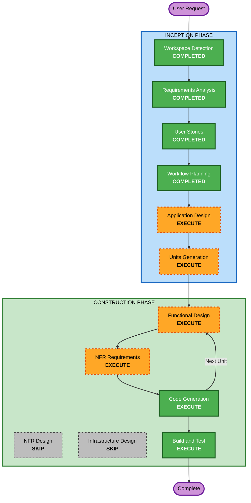

# Execution Plan — AutoCoder

## Detailed Analysis Summary

### Change Impact Assessment
- **User-facing changes**: Yes — 6 new MVP features, all user-interactive
- **Structural changes**: Yes — new full-stack application architecture (Next.js App Router, Prisma ORM, Zustand stores, SSE streaming)
- **Data model changes**: Yes — new PostgreSQL schema (User, Project, Task, PipelineRun)
- **API changes**: Yes — new API routes (auth, tasks, pipeline, SSE endpoints)
- **NFR impact**: Yes — security (15 SECURITY rules), performance (SSE latency), reliability (pipeline recovery)

### Risk Assessment
- **Risk Level**: Medium
- **Rollback Complexity**: Easy (greenfield, no existing system to break)
- **Testing Complexity**: Complex (AI pipeline orchestration, SSE streaming, drag-and-drop)

---

## Workflow Visualization



### Text Alternative
```
Phase 1: INCEPTION
- Workspace Detection (COMPLETED)
- Requirements Analysis (COMPLETED)
- User Stories (COMPLETED)
- Workflow Planning (COMPLETED)
- Application Design (EXECUTE)
- Units Generation (EXECUTE)

Phase 2: CONSTRUCTION (per-unit loop)
- Functional Design (EXECUTE per unit)
- NFR Requirements (EXECUTE per unit)
- NFR Design (SKIP)
- Infrastructure Design (SKIP)
- Code Generation (EXECUTE per unit)
- Build and Test (EXECUTE)
```

---

## Phases to Execute

### INCEPTION PHASE
- [x] Workspace Detection — COMPLETED
- [x] Requirements Analysis — COMPLETED
- [x] User Stories — COMPLETED
- [x] Workflow Planning — COMPLETED
- [ ] Application Design — **EXECUTE**
  - **Rationale**: New components needed (AI pipeline orchestrator, Kanban board, agent log panel, diff viewer, task modal). Service layer design required for pipeline orchestration. Component dependencies need clarification (how stores, API routes, SSE endpoints, and UI components interact).
- [ ] Units Generation — **EXECUTE**
  - **Rationale**: 6 MVP features with distinct concerns need decomposition into ordered implementation units. Dependencies between features (e.g., auth before projects, projects before tasks, tasks before pipeline) require structured breakdown.

### CONSTRUCTION PHASE (per-unit)
- [ ] Functional Design — **EXECUTE**
  - **Rationale**: Complex business logic in AI pipeline orchestration (state machine with retry loops, agent coordination, auto-fix flow). Data models need detailed design (User, Project, Task, PipelineRun relationships). Kanban state transitions and SSE event protocols need specification.
- [ ] NFR Requirements — **EXECUTE**
  - **Rationale**: 15 SECURITY extension rules enforced. Performance targets defined (SSE latency < 500ms, page load < 3s). Auth requires bcrypt hashing, session management, CSRF protection. Rate limiting needed on auth endpoints.
- [ ] NFR Design — **SKIP**
  - **Rationale**: NFR patterns for this project are well-understood (Next.js middleware for security headers, Prisma for parameterized queries, bcrypt for password hashing, Zod for validation). These can be incorporated directly during Code Generation without a separate design phase.
- [ ] Infrastructure Design — **SKIP**
  - **Rationale**: Local dev deployment (Docker Compose for PostgreSQL + Next.js dev server). No complex cloud infrastructure to map. Docker and Vercel configs are standard Next.js patterns that can be generated during Code Generation.
- [ ] Code Generation — **EXECUTE** (ALWAYS)
  - **Rationale**: Full implementation of all units
- [ ] Build and Test — **EXECUTE** (ALWAYS)
  - **Rationale**: Build verification, testing instructions, and validation

### OPERATIONS PHASE
- [ ] Operations — PLACEHOLDER

---

## Success Criteria
- **Primary Goal**: Working AutoCoder MVP with all 6 features functional
- **Key Deliverables**: Full-stack Next.js application, PostgreSQL schema, AI pipeline, Kanban UI, SSE streaming, Diff review
- **Quality Gates**: All 15 SECURITY rules compliant, all 54 user stories covered, all acceptance criteria testable
